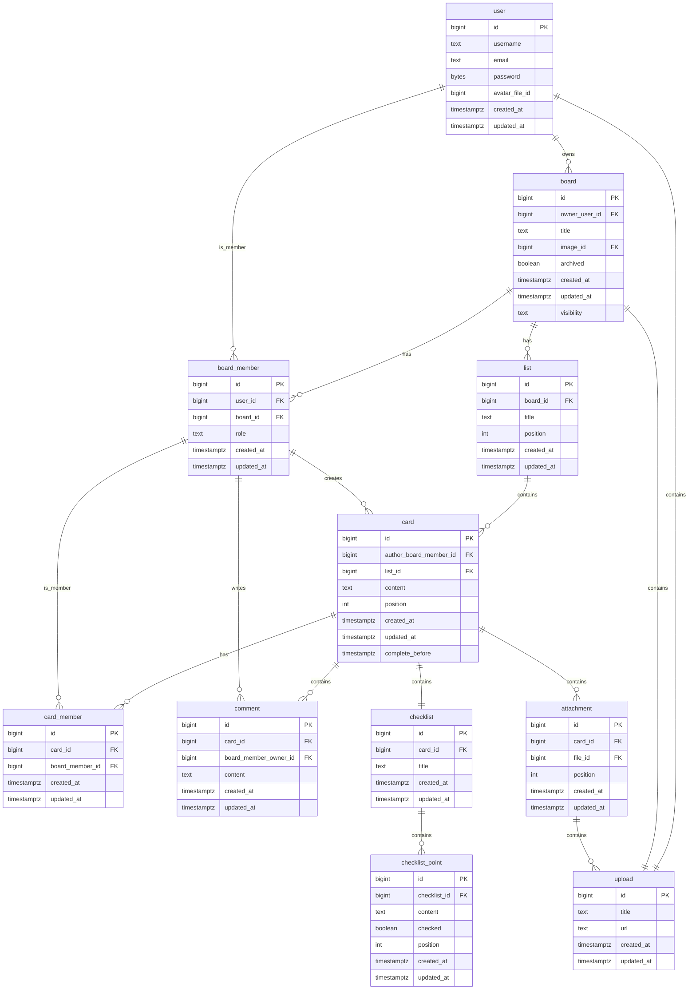

```mermaid
    erDiagram
	user {
		bigint id PK 
		text username  
		text email   
		bytes password 
        bigint avatar_file_id  
        timestamptz created_at
        timestamptz updated_at
	}

	board {
		bigint id PK  
		bigint owner_user_id FK
		text title   
		bigint image_id FK
		boolean archived  
		timestamptz created_at
        timestamptz updated_at
        text visibility
	}

    board_member {
		bigint id PK 
        bigint user_id FK 
        bigint board_id FK  
		text role  
        timestamptz created_at   
        timestamptz updated_at
	}

	list {
		bigint id PK   
		bigint board_id FK
		text title  
        int position 
		timestamptz created_at   
        timestamptz updated_at
	}

	card {
		bigint id PK   
		bigint author_board_member_id FK  
		bigint list_id FK  
		text content  
		int position  
		timestamptz created_at  
        timestamptz updated_at
		timestamptz complete_before  
	}

	card_member {
		bigint id PK   
		bigint card_id FK  
        bigint board_member_id FK
        timestamptz created_at   
        timestamptz updated_at
	}

    comment {
		bigint id PK    
		bigint card_id FK   
		bigint board_member_owner_id FK   
		text content    
		timestamptz created_at 
        timestamptz updated_at
	}

	attachment {
		bigint id  PK   
		bigint card_id FK    
		bigint file_id FK   
		int position  
		timestamptz created_at   
        timestamptz updated_at
	}

	checklist {
		bigint id  PK   
		bigint card_id  FK  
		text title   
		timestamptz created_at    
        timestamptz updated_at
	}

	checklist_point {
		bigint id  PK 
		bigint checklist_id FK  
		text content   
		boolean checked   
		int position  
		timestamptz created_at  
        timestamptz updated_at
	}

	upload {
		bigint id  PK
		text title
		text url
		timestamptz created_at 
        timestamptz updated_at
	}

	user||--o{board:"owns"
	user||--||upload:"contains"
	board||--o{list:"has"
	board||--o{board_member:"has"
	board||--||upload:"contains"
	user||--o{board_member:"is_member"
	list||--o{card:"contains"
	board_member||--o{card:"creates"
	card||--o{card_member:"has"
	board_member||--o{ card_member:"is_member"
	card||--o{comment:"contains"
	board_member ||--o{comment:"writes"
	card||--o{attachment:"contains"
	card||--||checklist:"contains"
	checklist||--o{checklist_point:"contains"
	attachment||--o{upload:"contains"
```
