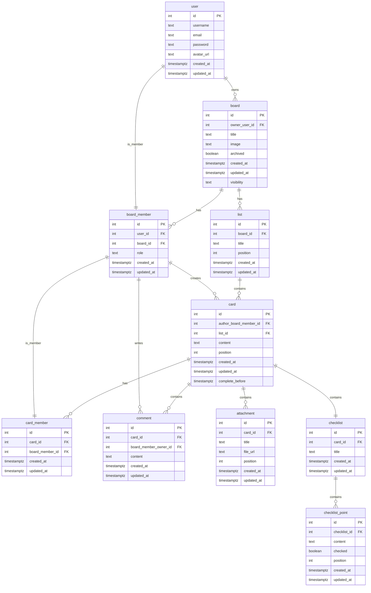

```mermaid
    erDiagram
	user {
		int id PK 
		text username  
		text email   
		text password 
        text avatar_url  
        timestamptz created_at
        timestamptz updated_at
	}

	board {
		int id PK  
		int owner_user_id FK
		text title   
		text image 
		boolean archived  
		timestamptz created_at
        timestamptz updated_at
        text visibility
	}

    board_member {
		int id PK 
        int user_id FK 
        int board_id FK  
		text role  
        timestamptz created_at   
        timestamptz updated_at
	}

	list {
		int id PK   
		int board_id FK
		text title  
        int position 
		timestamptz created_at   
        timestamptz updated_at
	}

	card {
		int id PK   
		int author_board_member_id FK  
		int list_id FK  
		text content  
		int position  
		timestamptz created_at  
        timestamptz updated_at
		timestamptz complete_before  
	}

	card_member {
		int id PK   
		int card_id FK  
        int board_member_id FK
        timestamptz created_at   
        timestamptz updated_at
	}

    comment {
		int id PK    
		int card_id FK   
		int board_member_owner_id FK   
		text content    
		timestamptz created_at 
        timestamptz updated_at
	}

	attachment {
		int id  PK   
		int card_id FK  
		text title  
		text file_url  
		int position  
		timestamptz created_at   
        timestamptz updated_at
	}

	checklist {
		int id  PK   
		int card_id  FK  
		text title   
		timestamptz created_at    
        timestamptz updated_at
	}

	checklist_point {
		int id  PK 
		int checklist_id FK  
		text content   
		boolean checked   
		int position  
		timestamptz created_at  
        timestamptz updated_at
	}

	user||--o{board:"owns"
	board||--o{list:"has"
	board||--o{board_member:"has"
	user||--||board_member:"is_member"
	list||--o{card:"contains"
	board_member||--o{card:"creates"
	card||--o{card_member:"has"
	board_member||--|| card_member:"is_member"
	card||--o{comment:"contains"
	board_member ||--o{comment:"writes"
	card||--o{attachment:"contains"
	card||--||checklist:"contains"
	checklist||--o{checklist_point:"contains"
```
